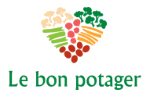

# Le bon potager

### Serveurs Web
* [apache](https://httpd.apache.org/ "Official website")
* [nginx](https://nginx.com/ "Official website")

### Base de donnée
* [MySQL](https://mysql.com/ "Official website")

### Outils d'administration de BDD
* [phpMyAdmin](https://phpmyadmin.net/ "Official website")

### Gestionnaire de dépendances
* [Composer](https://getcomposer.org/ "Official website")

### Languages
* [HTML5](https://www.w3.org/TR/html5/ "Official website") & [CSS3](https://www.w3.org/Style/CSS/ "Official website")
* [PHP](https://php.net/ "Official website") - 7.1.9

### Membres
* Alexandre BACA - <alexandre.baca@viacesi.fr>
* Lucien BROUILLAUD - <lucien.brouillaud@viacesi.fr>
* Christophe COUERBE - <christophe.couerbe@viacesi.fr>
* Charles GILLET - <charles.gillet@viacesi.fr>
* Nicolas KAMPHAUS - <nicolas.kamphaus@viacesi.fr>

### Config serveur web
> 127.0.0.1 lebonpotager.fr

* windows
> C:\windows\system32\drivers\etc\hosts

* Linux
> /etc/hosts
